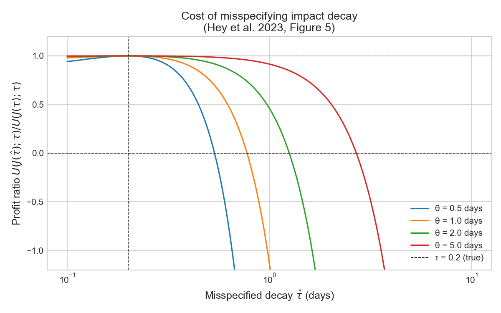

# Optimal Execution under Price Impact Misspecification

Implementation and extension of two recent papers on optimal execution with price impact:

- **Hey, Bouchaud, Mastromatteo, Muhle-Karbe & Webster (2023)** — *The Cost of Misspecifying Price Impact* (CFM / Imperial College London)
- **Nutz, Webster & Zhao (2025)** — *Unwinding Stochastic Order Flow: When to Warehouse Trades* (Columbia University)

## Motivation

Portfolio managers trade off return predictions (alpha signals) against transaction costs (price impact). This project studies what happens when the price impact model is misspecified — i.e., when the trader uses incorrect parameters to describe how their trades move the market.

The central result: **misspecification costs are asymmetric**. Overestimating impact aggressiveness (underestimating concavity $c$, or overestimating decay $\tau$) can turn profitable strategies into losing ones. Conversely, being too conservative only shrinks profits.

## Model

We implement the **AFS model** (Alfonsi, Fruth & Schied, 2010), where price impact is a nonlinear function of a moving average of order flow:

$$I_t = \lambda \, \text{sign}(J_t) |J_t|^c, \qquad dJ_t = -\frac{1}{\tau} J_t \, dt + dQ_t$$

**Key parameters:**
- $c \in (0, 1]$ — impact concavity. Empirically $c \approx 0.48$ (square-root law)
- $\tau$ — impact decay timescale. Empirically $\tau \approx 0.2$ days (~2 hours)
- $\lambda$ — impact scale, calibrated from data

**Optimal trading strategy** (Hey et al., Eq. 2.4):

$$I^*_t = \frac{1}{1+c} \left( \alpha_t - \tau \mu^\alpha_t \right)$$

where $\alpha_t$ is the alpha signal and $\mu^\alpha_t$ its drift. Key intuitions:
- For $c = 0.5$: optimal impact = $\frac{2}{3} \alpha$ (pay two thirds of alpha in impact)
- For $c = 1$: optimal impact = $\frac{1}{2} \alpha$ (linear model trades more conservatively)
- Faster alpha decay → trade more aggressively before signal disappears

## Results

### Module 1 — Misspecification costs (Hey et al. 2023)

**Figure 4** — Cost of misspecifying impact concavity $c$:

Profit ratio $U(J(\hat{c}); c) / U(J(c); c)$ as a function of misspecified concavity $\hat{c}$.
- Right of true $c$: overestimating concavity → conservative trading → shrinks profits but stays positive
- Left of true $c$: underestimating concavity → aggressive trading → can turn negative
- Higher Sharpe signals are more sensitive to misspecification

**Figure 5** — Cost of misspecifying impact decay $\tau$:

- Underestimating $\tau$ → conservative → small cost
- Overestimating $\tau$ → aggressive → sharp losses, especially for fast-decaying alpha

**Key takeaway**: when uncertain about impact parameters, err on the conservative side.

## Project Structure
